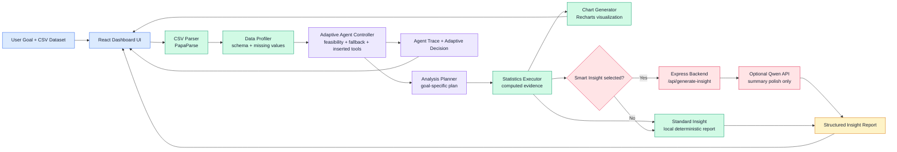

# StudyInsight: Goal-Aware CSV Data Analysis Agent

Demo video link: _add your demo video link here_

## Project Summary

StudyInsight is a full-stack prototype of a task-specific adaptive software agent for CSV data analysis. The user uploads a CSV file or loads a sample dataset, selects an analysis goal, chooses an insight generation mode, and runs an agent that observes the dataset, evaluates whether the selected goal is feasible, adapts the analysis plan, executes deterministic analysis tools, creates visualizations, and generates a structured insight report.

This project implements the course requirement of an intelligent software agent that can perceive input, make decisions, and take actions toward a goal. It is intentionally not a chatbot interface. The agent behavior is visible through the Agent Workflow, Adaptive Decision, Agent Plan, Agent Trace, Tool Execution Results, Visualization, and Insight Report sections.

## Problem Definition And Motivation

Many students and non-expert users can open a CSV file but may not know which analysis steps are appropriate. A fixed dashboard can show pre-defined charts, while a chatbot may produce fluent but unsupported explanations. StudyInsight addresses this gap by acting as a goal-aware data analysis agent.

The agentic approach is appropriate because CSV analysis requires conditional decisions:

- The agent must inspect the dataset before selecting tools.
- Some goals require specific column types, such as numeric columns for correlations or anomaly detection.
- Missing values may affect analysis quality and should trigger warnings or cleaning recommendations.
- If the selected goal is not feasible, the agent should fall back to a safer analysis instead of crashing or inventing results.

## Agent Scope

StudyInsight is a task-specific adaptive data analysis agent, not a general-purpose autonomous agent. It operates inside a controlled CSV analysis environment and uses a fixed set of tools:

- CSV parser
- Data profiler
- Adaptive agent controller
- Analysis planner
- Missing value scanner
- Cleaning strategy advisor
- Statistics executor
- Chart generator
- Insight generator
- Optional backend LLM summarizer

The agent does not browse the web, modify files, persist long-term memory, or take open-ended actions outside the analysis workflow. This limited scope is deliberate: it makes the behavior stable, inspectable, and suitable for a short academic demo.

## Why This Is An Agent

StudyInsight demonstrates agentic behavior because it follows an observe-decide-act loop:

1. **Perceive input:** The agent receives a user goal and a CSV dataset.
2. **Observe environment state:** It profiles rows, columns, numeric fields, categorical fields, and missing values.
3. **Evaluate feasibility:** The adaptive controller checks whether the selected goal can be safely executed.
4. **Adapt the plan:** It inserts extra tools for missing values or falls back to Overall Summary when the selected goal is not feasible.
5. **Execute tools:** It runs deterministic statistical tools rather than relying on the LLM for computation.
6. **Observe results:** It records computed results such as grouped means, correlations, IQR bounds, and missing-value summaries.
7. **Generate output:** It creates charts and a structured insight report.

The Agent Trace makes this action-observation process visible to the user.

## Adaptive Agent Behavior

The adaptive controller is implemented in `client/src/agent/controller.js`.

It performs three main tasks:

- `analyzeDatasetState(profile)` observes dataset conditions such as missing values, numeric columns, categorical columns, and goal feasibility.
- `selectAdaptiveGoal(goal, datasetState)` decides whether the selected goal is feasible or whether a fallback is needed.
- `createAdaptivePlan(profile, goal, targetColumn)` wraps the base planner, inserts adaptive tools, and returns the executed goal and reasoning.

Examples of adaptive behavior:

- If missing values exist, the agent inserts `Missing Value Scanner` and `Cleaning Strategy Advisor` steps.
- If `Find Relationships` is selected but fewer than two numeric columns are available, the agent falls back to `Overall Summary`.
- If `Compare Categories` is selected but no categorical or numeric columns are available, the agent falls back to `Overall Summary`.
- If `Detect Anomalies` is selected but no numeric columns are available, the agent falls back to `Overall Summary`.
- Recommended Next Actions allow the user to continue the analysis loop without auto-running a new analysis.

The agent does not automatically impute missing values or alter the uploaded dataset. It only detects, reports, visualizes, and recommends possible cleaning strategies.

## Supported Analysis Goals

- **Overall Summary:** Profiles the dataset, summarizes numeric columns, reports missing values, and shows a summary visualization.
- **Compare Categories:** Selects a categorical column and a numeric column, computes grouped means, ranks highest and lowest groups, and visualizes group differences.
- **Find Relationships:** Computes pairwise correlations across numeric columns, identifies the strongest relationship, and generates a scatter plot.
- **Detect Anomalies:** Selects a numeric column, computes IQR bounds, flags potential outliers, and summarizes anomaly counts.

## User Features

Users can:

- Upload a CSV file with headers.
- Load a built-in sample dataset.
- Choose one of four analysis goals:
  - Overall Summary
  - Compare Categories
  - Find Relationships
  - Detect Anomalies
- Optionally choose a target column.
- Choose an insight generation mode:
  - Standard Insight
  - Smart Insight
- Run the adaptive analysis agent.
- Click Recommended Next Actions to continue the analysis loop.

After each run, the app displays:

- **Agent Workflow:** High-level progress through the agent loop.
- **Adaptive Decision:** Original goal, executed goal, fallback status, dataset warnings, and inserted tools.
- **Dataset Preview:** Sample rows, detected column types, and missing-value metrics.
- **Agent Plan:** Planned tool steps, reasons, and adaptive tool badges.
- **Agent Trace:** Action-observation log showing what the agent did and why.
- **Tool Execution Results:** Computed statistics such as summaries, grouped means, correlations, IQR bounds, and missing-value tables.
- **Visualization:** Goal-specific chart, including missing-value charts when relevant.
- **Insight Report:** Summary, key findings, recommended next steps, limitations, and recommended next actions.

## System Architecture



The architecture separates the user interface, adaptive controller, deterministic analysis tools, optional backend LLM summarizer, and visible explanation components. The LLM is not responsible for statistical computation; it only summarizes results that were already produced by tools.

## Tools Used By The Agent

- **CSV Parser:** Reads uploaded CSV files with headers.
- **Data Profiler:** Computes dataset shape, column types, missing counts, and sample rows.
- **Adaptive Agent Controller:** Checks feasibility, inserts tools, and handles fallback decisions.
- **Analysis Planner:** Produces human-readable plan steps with tool names and reasons.
- **Statistics Executor:** Computes actual numerical results.
- **Missing Value Scanner:** Reports missing cells and affected columns.
- **Cleaning Strategy Advisor:** Suggests possible cleaning strategies without modifying data.
- **Chart Generator:** Uses Recharts for bar charts and scatter plots.
- **Insight Generator:** Produces structured reports.
- **Optional LLM Summarizer:** Uses Qwen only to polish or summarize computed results.

## Insight Generation Modes

### Standard Insight

Standard Insight is local, deterministic, and template-based. It requires no API key and works even if the backend is not running.

### Smart Insight

Smart Insight sends computed results to the backend and optionally uses a Qwen-compatible LLM API to polish the report. The LLM does not perform the numerical analysis. If the API key is missing, the backend is unavailable, or the API call fails, the frontend automatically falls back to Standard Insight.

API keys are never placed in the frontend.

## Qwen API Configuration

Smart Insight is optional. To enable it, create a `server/.env` file and add your own Qwen API key there. Do not put API keys in the frontend.

For Singapore or international Alibaba Cloud Model Studio accounts, use:

```text
https://dashscope-intl.aliyuncs.com/compatible-mode/v1
```

For China mainland DashScope accounts, the endpoint may be:

```text
https://dashscope.aliyuncs.com/compatible-mode/v1
```

The backend reads these environment variables:

- `QWEN_API_KEY`
- `QWEN_BASE_URL`
- `QWEN_MODEL`
- `PORT`

If the API key or backend is unavailable, the frontend automatically falls back to Standard Insight.

## Tech Stack

- Frontend: React, Vite, PapaParse, Recharts
- Backend: Node.js, Express, CORS, dotenv, OpenAI SDK
- LLM Provider: Qwen-compatible OpenAI-style endpoint, optional
- Database: none

## How To Run

### Frontend

```bash
cd client
npm install
npm run dev
```

Open the Vite URL shown in the terminal, usually:

```text
http://localhost:5173
```

On Windows PowerShell, use `npm.cmd` if `npm` is blocked:

```powershell
npm.cmd install
npm.cmd run dev
```

### Backend

```bash
cd server
npm install
npm run dev
```

The backend runs on:

```text
http://localhost:5000
```

## Evaluation And Testing

The prototype was tested with these representative cases:

| Test Case | Expected Behavior |
|---|---|
| Student dataset + Find Relationships | Goal is feasible, correlation tools run, scatter chart renders |
| Dataset with missing values + Overall Summary | Missing-value tools are inserted, missing-value summary appears |
| Categorical-only CSV + Find Relationships | Agent falls back to Overall Summary |
| Recommended Next Action clicked | Old results clear, user is prompted to run the next analysis |
| Smart Insight without available backend/API | App falls back to Standard Insight |

Additional technical checks:

```bash
cd client
npm run build
```

The frontend build should complete successfully.

## Implementation Quality Notes

- Numerical analysis is performed by deterministic JavaScript tools, not by the LLM.
- Smart Insight only summarizes computed results.
- The app does not expose API keys to the browser.
- The app does not use a database, so no user data is persisted.
- Chart and result components include defensive checks to avoid crashes when data is missing or goals change.
- Recommended Next Actions do not auto-run; they update the selected goal and ask the user to run the agent again.

## Critical Reflection And Limitations

- The agent is task-specific and operates only within CSV data analysis.
- A more general agent would be able to interact with richer external environments, such as websites, forms, filesystems, APIs, or PowerShell/terminal sessions, then update its strategy from the feedback it receives. StudyInsight has a narrower environment: the uploaded dataset and the analysis UI.
- The adaptive behavior is meaningful but bounded. The controller can inspect dataset state, insert missing-value tools, and fall back to safer goals, but it does not perform open-ended multi-step exploration outside the predefined analysis tools.
- It does not perform advanced statistical tests such as regression modeling, hypothesis testing, or causal inference.
- It detects and reports missing values but does not automatically impute them, because cleaning strategies depend on data context.
- It does not save analysis history or maintain long-term memory.
- Smart Insight depends on external API availability and model quality.
- The current adaptive controller uses rule-based decisions rather than learned policies.
- Future improvements could include user-confirmed cleaning actions, richer statistical tests, persistent report memory, interactive external tool use, and more advanced feedback-driven planning.

## Repository Structure

```text
studyinsight-agent/
  client/
    src/
      agent/
        controller.js
        profiler.js
        planner.js
        executor.js
        insightGenerator.js
        sampleData.js
      components/
      utils/
  server/
    services/
      llmService.js
    prompts/
      insightPrompt.js
```
